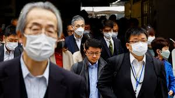
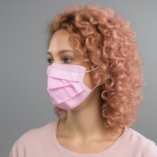
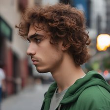
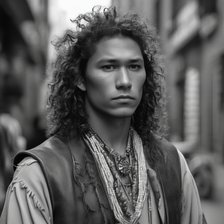

## Lightweight Face Mask Detection (SupCon-FCN + XGBoost, YOLOv11 + DeepSORT)

This repository contains a lightweight, on-device-friendly face mask classification pipeline and a prototypical end-to-end detection + tracking system. The core contribution is a compact Fully Convolutional Network (FCN) built with MBConv2D blocks trained with Supervised Contrastive Learning (SupCon), whose 128-D embeddings are classified by XGBoost. For real-time video, YOLOv11 detects faces, DeepSORT tracks them, and three classifiers (EfficientNetV2-B0, FCN+MLP, FCN+XGBoost) provide per-track mask/no-mask labels.

### Quick links
- **Paper**: [`Lightweight_FM_Detection.pdf`](./Lightweight_FM_Detection.pdf)
- **Main demo script**: [`yolo_tracking.py`](./yolo_tracking.py)
- **Pretrained checkpoints**: `training/checkpoints/`
- **Example media**: videos and images in the repo (see Media Gallery below)

---

## Problem & Motivation

Face mask usage remains relevant for healthcare, public transport, and crowded spaces. Real-world deployments often run on edge devices, where memory and compute are scarce. The goal is to deliver a solution that:

- **Detects and classifies** faces as Mask vs NoMask
- **Runs efficiently** with a tiny memory footprint
- **Retains accuracy** comparable to stronger baselines
- **Integrates** into a real-time pipeline (detector + tracker + classifier)

---

## Approach Overview

- **Backbone**: A compact FCN composed of MBConv2D blocks (inspired by MobileNet/EfficientNetV2) outputs a 128-D embedding via a projection head.
- **Training objective**: Supervised Contrastive Learning (SupCon) produces disentangled, class-aware embeddings.
- **Classifier**: XGBoost on top of the 128-D embeddings for binary classification (Mask vs NoMask). We also compare against a small MLP head and an EfficientNetV2-B0 baseline.
- **Real-time prototype**: YOLOv11 detects faces, DeepSORT assigns track IDs, and per-track predictions are smoothed over time.

Key advantages from the paper:

- ~**5% of the parameters** of EfficientNetV2-B0 (~300K vs ~6M)
- ~**1.1 MB** memory for FCN embeddings + **~0.17 MB** for XGBoost
- **Comparable accuracy** to baseline while being much smaller

---

## Datasets

The project combines three sources for diversity and robustness:

- **Kaggle Face Mask Dataset**: ~7,553 images of masked/unmasked or mask-like coverings (bandanas, scarves). A mix of photo-realistic and augmented images.
- **MaskedFace-Net**: ~67,049 masked and ~67,049 unmasked images (augmented masks over FFHQ faces). We focus on Mask vs NoMask.
- **Synthetic (SDXL) dataset**: 2,400 images generated with Stable Diffusion XL to broaden subjects, scenes, mask types, and edge cases.

Preprocessing: All images resized to `224 x 224` (no aspect ratio preservation) to match common ConvNet inputs and EfficientNet sizes.

Data augmentation (from `training/preprocessing.py`):

- Random flip, rotation, zoom, translation, shear
- Random brightness/contrast, Gaussian noise
- Optional color jitter and random crop

---

## Repository Overview

```
face-mask-detection/
  yolo_tracking.py                # YOLOv11 + DeepSORT + 3 classifiers over tracks
  training/
    models.py                     # FCN (MBConv2D), EfficientNet baselines, HybridModel utilities
    preprocessing.py              # tf.keras data augmentation pipelines
    eval.py                       # Grad-CAM and visualization helpers
    checkpoints/                  # Pretrained weights (FCN, EfficientNet, XGBoost, hybrids)
  synth_data/                     # Example dataset structure (train/test, mask/nomask)
  test_face_mask.mp4, vid*.mp4    # Example input videos
  outvid*.mp4, output_video.mp4   # Example output videos
  test_image.jpeg                 # Example image
  Lightweight_FM_Detection.pdf    # Full paper
  pyproject.toml                  # Dependencies
```

---

## Installation

Requires Python 3.11+.

### Option A: Using uv (recommended)
1) Install `uv`: see `uv` docs.
2) From the repo root:

```bash
uv sync
```

This uses `pyproject.toml` and `uv.lock` to resolve versions.

### Option B: Using pip

```bash
python3 -m venv .venv && source .venv/bin/activate
pip install -U pip wheel setuptools
pip install \
  deep-sort-realtime ipykernel ipywidgets jupyter keras matplotlib nbformat \
  numpy==2.0.2 opencv-python pandas plotly plotnine safetensors scikit-image \
  scikit-learn==1.5.2 seaborn shap tensorflow==2.18 tf-metric-learning \
  torch torchvision ultralytics xgboost
```

Note: `ultralytics` (YOLO) and `torch` will try to use your GPU if available. Ensure proper CUDA/cuDNN drivers or use CPU.

---

## Pretrained Checkpoints

Already included under `training/checkpoints/`:

- `fcn_mbconv.weights.h5` (FCN-based feature extractor)
- `xgboost_mbconv_model.bin` (XGBoost classifier)
- `hybridfcnmlp.keras` (FCN + MLP head variant)
- `effnetv2b0frozen.keras` (baseline EfficientNetV2-B0)

YOLOv11 face detector weights (in repo root):

- `yolov11l-face.pt`
- `yolov11n-face.pt` (alternative)

---

## Run: Real-time Detection, Tracking, and Classification

The main entry point is [`yolo_tracking.py`](./yolo_tracking.py). It:

1) Loads YOLOv11 face detector and DeepSORT tracker
2) Loads three classifiers: FCN+XGBoost (primary), EfficientNetV2-B0 (baseline), FCN+MLP (abl.
3) Runs smoothing over the last N=10 frames for per-track stability
4) Annotates frames with the three classifier labels and writes output video

Quick start (uses default video path set in `__main__`):

```bash
python yolo_tracking.py
```

To process a different video without editing the file, you can run:

```bash
python -c "import yolo_tracking as y; y.main('./test_face_mask.mp4', output_file='output_video.mp4')"
```

Outputs are saved as MP4 with bounding boxes and per-track labels.

---

## Training & Evaluation

While the full training pipelines are provided as notebooks (see the `training/` directory), key components are:

- `training/models.py`: MBConv2D-based FCN, EfficientNet baselines, SupCon loss (`SupervisedContrastiveLoss`) and utilities
- `training/preprocessing.py`: augmentation pipeline
- `training/eval.py`: Grad-CAM utilities (`make_gradcam_heatmap`, `superimpose_gradcam`)

Example Grad-CAM usage (EfficientNetV2-B0 baseline):

```python
from training.eval import make_gradcam_heatmap, superimpose_gradcam
import keras, numpy as np

# model = keras.models.load_model('training/checkpoints/effnetv2b0frozen.keras')
# img_array = ... # shape (1, 224, 224, 3), preprocessed as the model expects
# heatmap = make_gradcam_heatmap(model, img_array, last_conv_layer_name='top_conv')
# overlay = superimpose_gradcam(img_array[0], heatmap, cam_path='gradcam_overlay.jpg')
```

---

## Results (from the paper)

Performance on the combined dataset suite (balanced classes):

| Model                               | Accuracy (%) | MCC    | F1     |
|-------------------------------------|--------------|--------|--------|
| EfficientNetV2-B0 (Frozen)          | 99.94        | 0.998  | 0.9995 |
| EfficientNetV2-B0 (Fine-tuned)      | 99.95        | 0.9991 | 0.9996 |
| MBConv FCN + XGBoost (ours)         | 99.61        | 0.9921 | 0.9965 |
| MBConv FCN + MLP (ablation)         | 96.65        | 0.9324 | 0.9665 |
| Conv FCN + XGBoost (ablation)       | 98.60        | 0.9730 | 0.9880 |

Observations:

- The lightweight FCN+XGBoost is very close to the EfficientNetV2-B0 baseline with a fraction of parameters and memory.
- SupCon embeddings are highly separable; SHAP analysis suggests the first ~20 features carry strong discriminative power.
- Grad-CAM shows both approaches attend to mouth/nose regions as expected.

---

## Discussion & Limitations

- The prototype detector+tracker+classifier pipeline was not exhaustively benchmarked for latency/FPS across devices; further profiling is encouraged.
- Datasets are diverse but primarily 224×224; additional testing on different resolutions and real-world capture would strengthen conclusions.
- Hyperparameter search (temperature, batch size, XGBoost settings) can be expanded; fusion MBConv2D (as in EfficientNetV2) is a potential future efficiency gain.

---

## Media Gallery

### Sample image



### Dataset samples (mask / no-mask)

<table>
  <tr>
    <td></td>
    <td></td>
  </tr>
  <tr>
    <td align="center">Mask</td>
    <td align="center">No Mask</td>
  </tr>
  <tr>
    <td></td>
    <td></td>
  </tr>
  <tr>
    <td align="center">Mask</td>
    <td align="center">No Mask</td>
  </tr>
  <tr>
    <td colspan="2" align="center"><em>More examples available under <code>synth_data/</code></em></td>
  </tr>
  <tr>
    <td colspan="2" align="center"><small>Note: If a specific sample path is missing locally, replace with any image under the same folders.</small></td>
  </tr>
  
</table>

### Processed video (annotated)

<video src="./output_video.mp4" controls width="640"></video>

If the video fails to load in your viewer, you can also download and open it directly: [`output_video.mp4`](./output_video.mp4). Additional examples: [`outvid2.mp4`](./outvid2.mp4), [`outvid5.mp4`](./outvid5.mp4).

---

## Citations

- Khosla et al., Supervised Contrastive Learning (NeurIPS 2020)
- Tan & Le, EfficientNetV2 (ICML 2021)
- Selvaraju et al., Grad-CAM (arXiv)
- Lundberg & Lee, SHAP (NIPS 2017)
- YOLOv11 overview (arXiv)

See the paper’s References section for full details.

---

## Acknowledgments

This work is part of the Computer Vision lecture in the Department of Data Science and Engineering at the University of Applied Sciences Upper Austria.

---

## License

No explicit license is included in this repository. If you intend to use or modify this code or the included weights/datasets, please clarify licensing with the authors or add a license file.

